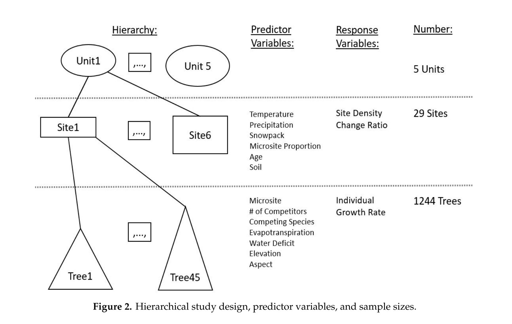

```{r setup, eval=TRUE, include=FALSE, warnings = FALSE}
knitr::opts_chunk$set(echo = TRUE)
source("./AnalysisToTurnIn.R")
```


```{r load packages, eval = TRUE, include = FALSE}
# load packages
```


\doublespacing

## Introduction
Whitebark pine (*Pinus albicaulis* Engelm.) is a conifer tree native to the mountains of the western United States and Canada. It inhabits subalpine areas where it can be found growing up to the tree line, at a higher elevation than other tree species found with it.

Whitebark pine (WBP) is an early successional species that is often the first to establish after disturbance such as wildfire.  WPB is a keystone species of subalpine environments where it plays important ecological roles such as providing food for wildlife such as Clark's Nutcracker and the threatened Grizzly Bear.

Due to threats from climate change, mountain pine beetle, and the invasive white pine blister rust, Whitebark pine has undergone a rapid and widespread decline.  It was recently estimated that over half of all standing WBP in the United States are dead.  This decline has lead to its recent listing as Threatened under the Endangered Species Act.  Future climate projections indicate further deterioration of WBP's habitat.

Strategies to conserve this species involve planting WBP seedlings for restoration of high-elevation forests.  Successful plantings in the face of climate change require an understanding of the relationship between climate and seedling establishment and growth in this species. Competition from other tree species also plays a role in seedling establishment and was investigated here.

This study investigated USFS plantings of WBP seedlings in the Greater Yellowstone Ecosystem (GYE) to answer two research questions: 
1) What is the relationship between climate/competition and WBP seedling establishment, measured by individual growth rate? 
2) What is the relationship between climate/competition and WBP seedling survival, measured by density change?

We are interested here in the first question relating to seedling growth rate.


## Methods

### Field Methods/Study design 


```{r fig1, fig.cap = "Map of planting units included in study in the Greater Yellowstone Ecosystem", echo = FALSE, out.width = '50%', fig.align='center'}
knitr::include_graphics("Figure1.png")
```

Over the past 40 years, the US Forest Service and National Park Service has planted more than 1500 acres of whitebark pine in the GYE.  This study investigated five planting units (figure \@ref(fig:fig1)) that each contained between two and eight planting sites. 

This study used a hierarchical sampling design including 5 planting units, with a total of 29 planting sites across units, and thousands of white bark pine seedlings per planting site. (See figure \@ref(fig:fig2) for model design.)

```{r fig2, fig.cap = "Visualization of study design", echo = FALSE, out.width = '75%', fig.align='center'}

```
Sampling took place from May 2018 to October 2018. A grid cell matrix of 10m x 10m was overlaid on the study site or unit. A random starting point was decided and then every 20th grid cell from that was sampled, equating to sampling between 2-15% of each site. Each seedling within that grid cell was digitally tagged, and Survey123 was used to collect field data. 

Researchers were most interested in the annual growth rate. Seedlings were too small to measure growth rings via coring, so height was used as a proxy for growth rate. Specifically, growth rate was calculated as the change in height between the study year (2018) to the relative planted height when the seedling was first planted. This was divided by the number of years since planting minus 2.5 years to account for the period of time when seedlings sequester carbon instead of focusing on their own growth. 

Initially, we can look at a box plot of the raw data to see if growth rates may vary between planting units. Figure \@ref(fig:fig4) shows that there might be slight differences between the planting units, especially for the West Yellowstone (WY) unit. However, any apparent differences may be a result of a difference in the age of the seedlings. This plot is equivalent to Figure 4 in the original paper.

```{r fig4, echo = FALSE, eval = TRUE, warnings = FALSE}
fig4
```

Researchers collected a variety of environmental variables, but for simplification purposes, we chose the most ecologically interesting variables, which are documented below. 

- Explanatory variables are as follows: 
  - AET - Mean actual evapotranspiration (mm) during growing season (April–October)
  - PET - Mean potential evapotranspiration (mm) during growing season (April–October)
  - PPT - Mean annual precipitation (mm)
  - Micro - This was a binary variable indicating presence of favorable microsite conditions. 1 if there was a rock or other topographical feature that changed the environmental conditions where the seedling lived.
  - Comp\_number - number of competitors within a 3.59m radius
  - PICO - Presence of *Pinus contorta* within 3.59m radius of WBP. 1 if PICO is present, 0 otherwise.
  - PIEN - Presence of *Pinus engelmannii* within 3.59m radius of WBP. 1 if PIEN is present, 0 otherwise.
  - ABLA - Presence of *Abies lasiocarpa* within 3.59m radius of WBP. 1 if ABLA is present, 0 otherwise.
  
```{r pairs, echo = FALSE, eval = FALSE, warnings = FALSE, fig.caption = "Pairs plot looking at log growth rate with other explanatory variables"}
#this takes a very long time to render so not running it now
pairs_plot
```
 
Using the variables of interest, we looked for correlation with a pairs plot, which can be seen in Figure \@ref(fig:pairs). The highest correlation value is -0.681 between annual temperature and AET. The next highest was between AET and group. All other values were below 0.6 and were not of concern. We did not remove any of these variables are they are pertinent to our research question. 

There are only 5 units and only 29 sites within each of those units, resulting in a somewhat small sample size. However, with over 1000 seedlings within each site/unit combination, there is a of replication within each unit. 

### Statistical Procedures Used
Data were provided by Laufenberg, but the process of cleaning and structuring the data were not explicit in the paper. As such, we had to experiment to figure out how data were cleaned. We did this by modifying data in an ecologically reasonable way while comparing raw data plots to the paper. A few examples of data cleaning are:
  - Creating AET which is the total annual evapotranspiration. To get this, we multiplied the average monthly evapotranspiration by 7 for the 7 months of the growing season. The same was done for PET or potential evapotranspiration. 
  - multiplying p by 12 to get the total "annual precipitation".
  - using $log_{10}$ to transform growth rate. 

Mixed effects models were used to study what covariates were correlated with white bark pine performance. Random effects were always used for the unit. A variety of interactions, linear and polynomial functions, and fixed effects were explored. A corrected AIC was used to compare models. We attempted to find the most parsimonious set of water balance variables while still incorporating the biologically relevant variables and incorporating environmental variables related to the research questions (including number of competitors, age of planting, and microsite status). All analysis was done use R statistical software. 

We ran the most full model below, and then refined it based on AIC score (less than 2).

$\mu${$growth_{rate} | AET + PET + PPT + T + Micro + Comp\_number + PICO + PIEN + ABLA + random (Unit)$} = XXXXX

## Results/Summary of Statistical Findings
The initial full model, with all variables of interest, had an AICc of 1134.65. We used the step function to select the best model, and our final model has an AICc of 1122.34. 

ONLY GOT ONE DIAGNOSTIC PLOT FOR THE MODEL. 

The final model is lmer(log_growth_rt ~ poly(aet,3) + poly(pet,3) + poly(aet,2) + poly(pet,2) + poly(comp_number,3) + poly(comp_number,2) + aet + pet + comp_number +PICO +  (1 | unit), df)

- The final model, decided with drop1, is aet^3, pet^3 + comp_number^3 + PICO +ALBA


## Scope of Inference
- Random sampling = inferences to large population 
- No random treatment (because nature) = correlation/association but not causation. 

## Critique
- no clear model selection criteria or process
- difficult data cleaning and processing

## Group Work Statement

## References

## Appendix

- Must include a compiled RMarkdown with all of our results
