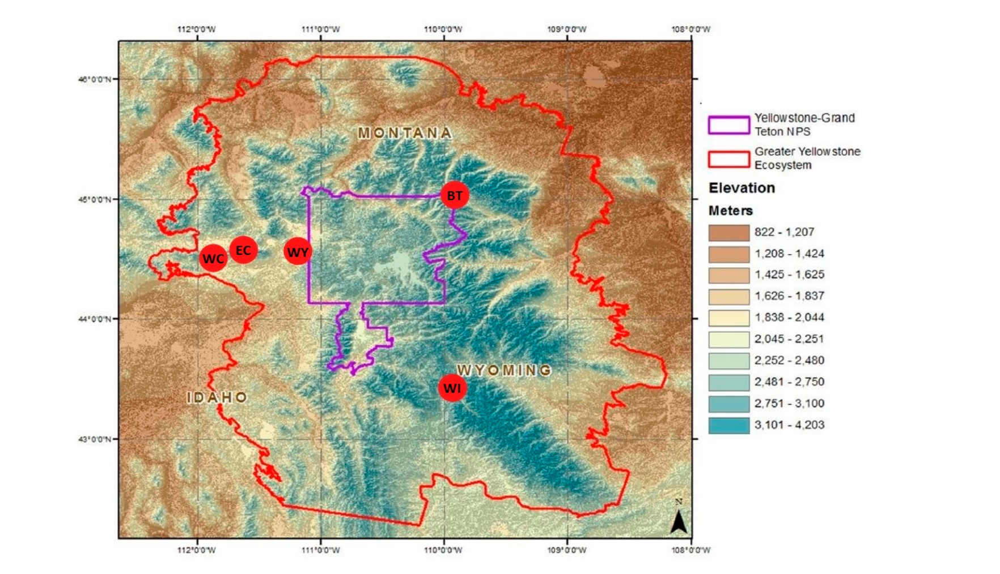
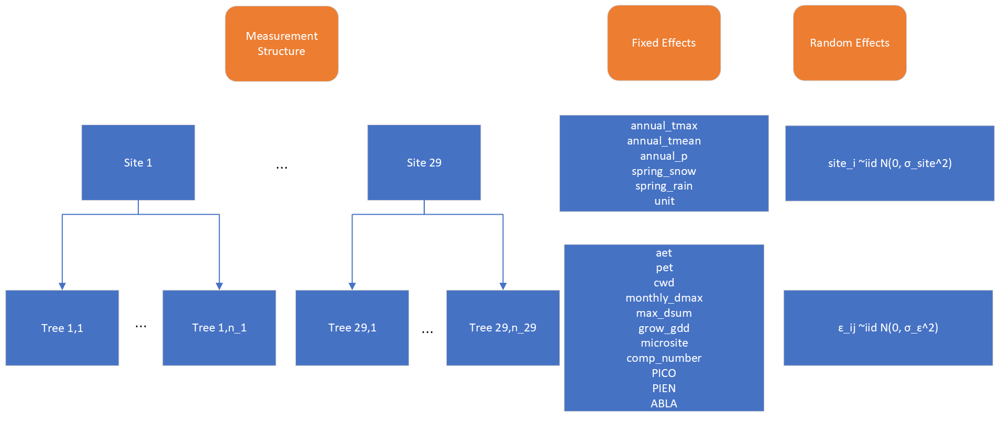

```{r setup, eval=TRUE, include=FALSE, warnings = FALSE}
knitr::opts_chunk$set(echo = TRUE, tidy.opts=list(width.cutoff=60),tidy=TRUE)

#use this to do floating figures for later
#out.extra='style="float:right; padding:10px"'
source("./AnalysisToTurnIn.R")
```


```{r load packages, eval = TRUE, include = FALSE}
# load packages
library(bookdown)
```


\doublespacing

## Introduction
Whitebark pine (*Pinus albicaulis* Engelm.; abbreviation: WBP) is a conifer tree native to the mountains of the western United States and Canada. It inhabits subalpine areas where it can be found growing up to the tree line, at a higher elevation than other tree species found with it. Whitebark pine is an early successional species that is often the first to establish after disturbance such as wildfire.  WPB is a keystone species of subalpine environments where it plays important ecological roles such as providing food for wildlife such as Clark's Nutcracker and the threatened Grizzly Bear.

Due to threats from climate change, mountain pine beetle, and the invasive white pine blister rust, Whitebark pine has undergone a rapid and widespread decline.  It was recently estimated that over half of all standing WBP in the United States are dead.  This decline has lead to its recent listing as Threatened under the Endangered Species Act.  Future climate projections indicate further deterioration of WBP's habitat. Strategies to conserve this species involve planting WBP seedlings for restoration of high-elevation forests.  Successful plantings in the face of climate change require an understanding of the relationship between climate and seedling establishment and growth in this species. Competition from other tree species also plays a role in seedling establishment and was investigated here.

Laufenberg et al. (2020) investigated USFS plantings of WBP seedlings in the Greater Yellowstone Ecosystem (GYE) to answer two research questions:    
1) What is the relationship between climate/competition and WBP seedling establishment, measured by individual growth rate?    
2) What is the relationship between climate/competition and WBP seedling survival, measured by density change?    

However, we chose to focus on a simplified question. We are interested in how annual evapotranspiration and water availability affect planted whitebark pine seedling growth after accounting for location, age, and competition.

## Methods

### Field Methods/Study design 

```{r fig1, fig.cap = "Map of planting units included in study in the Greater Yellowstone Ecosystem. Yellowstone National Park is outlined in purple, the greater yelowstone ecosystem is outlined in red, and the five white bark pine planting units run by the Forest Service and National Park service are circled in red. The two-letter abbreviation denotes the name: BT = Beartooth, EC = East Centennial, WC = West Centennial, WI =Wind River, WY =West Yellowstone", echo = FALSE, out.width = '75%', fig.align='center'}

```

Over the past 40 years, the US Forest Service and National Park Service has planted more than 1500 acres of WBP in the GYE. This study investigated five planting units (Figure \@ref(fig:fig1)) that each contained between two and eight planting sites. This study used a hierarchical sampling design including 5 planting units, with a total of 29 planting sites across units, and thousands of white bark pine seedlings per planting site. (See Figure \@ref(fig:fig2) for model design.)

```{r fig2, fig.cap = "Hierarchical study design with fixed and random effects.", echo = FALSE, out.width = '100%', fig.align='center'}

```
In the 5 larger planting units, no data aside from name of the unit, were collected. For the 29 sites scattered across those planting units (an unbalanced design), larger climatic data were recorded such as average annual temperature and average annual precipitation. (For a full list of data collected at each location, see Figure \@ref(fig:fig2). Then, seedlings within that site were sampled for annual growth rate. Seedlings were too small to measure growth rings via coring, so height was used as a proxy for growth rate. Specifically, growth rate was calculated as the change in height between the study year (2018) to the relative planted height when the seedling was first planted. This was divided by the number of years since planting minus 2.5 years to account for the period of time when seedlings sequester carbon instead of focusing on their own growth.

Sampling individual seedling growth occurred from May 2018 to October 2018. A grid cell matrix of 10m x 10m was overlaid on the study site or unit.  A random starting point was decided and then every 20th grid cell from that was sampled, equating to sampling WBP in between 2-15% of each site. Each seedling within that grid cell was digitally tagged, and Survey123 was used to collect field data. At each site, seedling heights (used to estimate growth rate) were collected as well as local climate data like elevation, aspect, water deficit, number of competitors, and amount of evapotranspiration. Water balance variables were estimated using Daymet devices as inputs for temperature and precipitation. A more in-depth description of data recorded is below:

The following predictor variables were evaluated:

\singlespacing
- Predictor variables are as follows: 
  - Age - Years since original seedling was planting
  - $T_{mean}$ - Mean annual temperature ($\degree$C)
  - $T_{max}$ - Max monthly temperature ($\degree$C)
  - PPT (mm) - Mean annual precipitation.
  - Snowpack (mm) - Mean spring (March-May) snowpack
  - $WD_{annual\_mean}$ - water deficit (mm), which is the amount of additional water a plant could use if it were available
  - AET - Mean actual evapotranspiration (mm) during growing season (April–October)
  - PET - Mean potential evapotranspiration (mm) during growing season (April–October)
  - GDD - Mean annual growing degree days (April-October)
  - Micro - This was a binary variable indicating presence of favorable microsite conditions. 1 if there was a rock or other topographical feature that changed the environmental conditions where the seedling lived.

\doublespacing
Researchers were most interested in the annual growth rate. Seedlings were too small to measure growth rings via coring, so height was used as a proxy for growth rate. Specifically, growth rate was calculated as the change in height between the study year (2018) to the relative planted height when the seedling was first planted. This was divided by the number of years since planting minus 2.5 years to account for the period of time when seedlings sequester carbon instead of focusing on their own growth. 

From examination of the raw data, growth rate appears to be similar across each planting unit, suggesting that no transformation is needed (Figure \@ref(fig:fig4)).

```{r fig4, echo = FALSE, eval = TRUE, warnings = FALSE, fig.cap="Growth rate compared with AET by each site", fig.height = 3}
aet_x_growthrt
```

At each site, data on seedling heights (used to estimate growth rate) and competing plant species was recorded. Water balance variables were estimated using Daymet devices as inputs for temperature and precipitation. 

Data were provided by Laufenberg, but the process of cleaning and structuring the data were not explicit in the paper. As such, we had to experiment to figure out how data were cleaned. We ultimately decided to create an annual evapotranspiration rate, given that it is extremely pertinent to our research question. To get this annual evapotranspiration (AET), we multiplied the average monthly evapotranspiration by 7 for the 7 months of the growing season. The same was done for mean water deficit (grow_dmean) to get climatic water deficit (CWD). 

Climate and water balance predictor variables were tested for colinearity with a cutoff of r >= +/- 0.6 (\@ref(fig:corr). A parsimonious list of water balance variables was selected by choosing the more biologically relevant variable from pairs that exceeded this threshold. This list of variables was then combined with the variables pertinent to the research question, which are $AET$ and $WD$. Following this process, our list of environmental components we would like to account for in the model are comp_number and microsite status. 

```{r corr, echo = FALSE, eval = TRUE, warnings = FALSE, fig.caption = "Correlation matrix of predictor variables. Darker squares indicate a higher degree of correlation. For variables that were at least 0.6 correlated, the most ecologically relevant one was selected"}
corr_plot

```


After data were selected based on their correlation, we looked at linearity and potential other polynomial forms (Figure \@ref(fig:pairsEDA)). From examination of the raw data, there is a little variance in growth rate by planting unit, which we will account for with a fixed effect of unit.

```{r pairsEDA, echo = FALSE, eval = TRUE, message = FALSE, fig.cap = "Raw data visualization of variables of interest", out.width = '60%', fig.align='center'}
pairs_plot
```


### Statistical Procedures Used
Mixed effects models were used to study what covariates were correlated with white bark pine performance. Random effects were always used for the unit. A variety of linear and polynomial functions, and fixed effects were explore. Cubic forms were explored due to the biological idea that WBP seedling establishment may vary drastically depending on the conditions. In below average conditions, we expect low growth rate. We expect there to be an average growth rate in average conditions, and then for high quality conditins, we expect a much higher growth rate - therefore following a cubic form. A corrected AIC was used to compare models. We attempted to find the most parsimonious set of water balance variables while still incorporating the biologically relevant variables and incorporating environmental variables related to the research questions (including number of competitors, age of planting, and microsite status). 

We ran the saturated cubic model without interactions \@ref(eq:full), and then refined it using backwards selection from the $step()$ function and a AIC cutoff of AIC<2. All analysis was done use R statistical software (v4.2.2; R Core Team 2021). 

The theoretical model for our full model analyzed is as follows:

```{=latex}
\begin{align*}
  log(growth\_rate)_{ij} &= \hat{\mu}_{ij} + Unit_i + \epsilon_{ij} \\
  Unit_i &\overset{iid}{\sim} \mathcal{N}(0, \sigma^2_{unit}) \\
  \epsilon_{ij} &\overset{iid}{\sim} \mathcal{N}(0, \sigma^2_{error}) \\
  \begin{split}
    \hat{\mu}_{ij} &= \beta_0 + \beta_1AET + \beta_2T_{max} + \beta_3PPT + \beta_4PET \\
    &+ \beta_5Comp\_number + \beta_6Micro + \beta_7PICO \\
    &+ \beta_8PIEN + \beta_9ABLA
  \end{split}
\end{align*}
```

## Results/Summary of Statistical Findings
Using backwards selection, the most parsimonious model is below, where $annual\_Tmax$ took on a quadratic form, and PIEN and Micro were removed. This model has an AIC score of `r round(AICc(final_cubic),2)`. 

```{=latex}
\begin{align*}
  log(growth\_rate)_{ij} &= \hat{\mu}_{ij} + Unit_i + \epsilon_{ij} \\
  Unit_i &\overset{iid}{\sim} \mathcal{N}(0, \sigma^2_{unit}) \\
  \epsilon_{ij} &\overset{iid}{\sim} \mathcal{N}(0, \sigma^2_{error}) \\
  \begin{split}
    \hat{\mu}_{ij} &= \beta_0 + \beta_1AET^3 + \beta_2AET^2 + \beta_3AET \\
                   &+ \beta_4PET^3 + \beta_5PET^2 + \beta_6PET \\
                   &+ \beta_7Comp\_number^3 + \beta_8Comp\_number^2 + \beta_9Comp\_number \\
                   &+ \beta_{10}PPT^3 + \beta_{11}PPT^2 + \beta_{12}PPT \\
                   &+ \beta_{13}T_{max}^2 + \beta_{14}T_{max} + \beta_{15}PICO + \beta_{16}ABLA
  \end{split}
\end{align*}
```

The initial full model, with all variables of interest, had an AICc of `r round(AICc(full_cubic),2)`. This was a `r round(AICc(full_cubic)-AICc(final_cubic),2)` reduction in AICc value. 

The final model suggests the WBP seedling growth is most correlated with the annual evapotranspiration, the potential evapotranspirtaion, the number of competitors around the seedling, annual precipitation, and max temperature while accounting for the random effect of planting unit.

Going forward, we would like to look into the following things:
 - We get the error "fixed-effect model matrix is rank deficient so dropping 14 columns / coefficients" and need to look at what that means.  
 - Better understand the variable selection process and why certain variables were included.  
 - Look for a more parsimonious model, perhaps dropping cubic forms.  
 - Creating diagnostic plots for mixed models 
 - Interpreting the coefficients and the 95% CI in the context of WPB restoration  
 - Insert model table 
 - Effects plot/model estimate
 - Random effect for sample site? 
 - Better define initial model and which betas are important
 

## Scope of Inference
Because there was random sampling of the WPB within each site, the inferences can be applied to the larger WBP population at that site, but because the sites and units were not randomly selected, no further inferences can be drawn. Furthermore, there was no treatment applied since this was an observational study, so inferences are only correlative, not causative.

## Critique
Trying to follow and reproduce what Laufenberg et al. 2020 did in the paper proved to be extremely complicated. There appeared to have been extensive data cleaning and manipulation, which was not communicated in the paper. We know that they chose the "more ecologically relevant" variable when looking at correlation, but there was no clear instructions on what that was. Furthermore, the paper had no clear model selection processes, making it difficult to reproduce. Many of their choices, such as using a cubic form for AET or log transforming growth rate, were not explained and the reasoning behind was unclear. The paper itself is fishing for an explanation. 

After trying and failing to reproduce the results from the paper, we streamline our research question and attempted to just use the data collected to answer what we were interested in. However, even that proved to be challenging. 

## Group Work Statement
Steve spearheaded the data wrangling and analysis, while Parker took lead on the write-up and formatting. Both people contributed to the interpretation, discussion, and critique. 

## References
- Laufenberg, David, et al. "Biophysical gradients and performance of whitebark pine plantings in the Greater Yellowstone Ecosystem." Forests 11.1 (2020): 119.
- R Core Team (2021). R: A language and environment for statistical computing. R Foundation for Statistical Computing, Vienna, Austria. URL https://www.R-project.org/.
- H. Wickham. ggplot2: Elegant Graphics for Data Analysis. Springer-Verlag New York, 2016.
- Douglas Bates, Martin Maechler, Ben Bolker, Steve Walker (2015). Fitting Linear  Mixed-Effects Models Using lme4. Journal of Statistical Software, 67(1), 1-48. doi:10.18637/jss.v067.i01.


## Appendix
- Must include a compiled RMarkdown with all of our results
- All code is in currently in an R script, will attach for final paper
